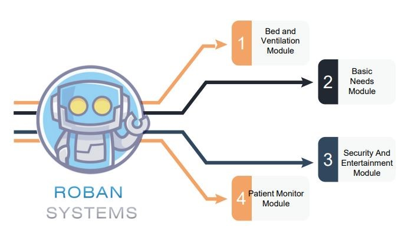

# Roban Systems: Helping Hand for Disabled People

Welcome to the Roban Systems project, a groundbreaking IoT solution designed to provide assistance and support to disabled individuals. This README file contains information about the project, its features, setup instructions, and more.

## Project Overview

Roban Systems aims to enhance the quality of life for disabled people by leveraging IoT technologies. The system utilizes sensors, actuators, and a smart control unit to automate tasks and provide assistance in daily activities, making life easier and more accessible for individuals with disabilities.

.jpg)
.png)
.jpg)

# SYSTEM OVERVIEW

## PROBLEM STATEMENT
Disabilities is an umbrella term, covering impairments, activity limitations, and participation restrictions. An impairment is a problem in body function or structure, An activity limitation is a difficulty encountered by an individual in executing a task or action, and A participation restriction is a problem experienced by an individual in involvement in life situations. As per Census 2011, in India, out of the total population of 121 crores, about 2.68 Cr persons are ‘Disabled’ (2.21%of the total population) Out of 2.68 crores, 1.5 crores are males and 1.18 crore are females Majority (69%) of the disabled population resided in rural areas.
People with disabilities often face various challenges in their day-to-day lives, hindering their ability to perform routine tasks independently and limiting their overall quality of life. It is crucial to explore innovative solutions that leverage the power of the Internet of Things (IoT) to address these challenges and empower individuals with disabilities. The goal of this project is to develop an IoT-based system that can provide assistance, accessibility, and convenience for people with disabilities, enabling them to navigate their environment, communicate effectively, and perform daily activities more efficiently. People with disabilities often face various challenges in their day-to-day lives, hindering their ability to perform routine tasks independently and limiting their overall quality of life. It is crucial to explore innovative solutions that leverage the power of the Internet of Things (IoT) to address these challenges and empower individuals with disabilities. The goal of this project is to develop an IoT-based system that can provide assistance, accessibility, and convenience for people with disabilities, enabling them to navigate their environment, communicate effectively, and perform daily activities more efficiently. People with disabilities often face various challenges in their day-to-day lives, hindering their ability to perform routine tasks independently and limiting their overall quality of life. It is crucial to explore innovative solutions that leverage the power of the Internet of Things (IoT) to address these challenges and empower individuals with disabilities. The goal of this project is to develop an IoT-based system that can provide assistance, accessibility, and convenience for people with disabilities, enabling them to navigate their environment, communicate effectively, and perform daily activities more efficiently.
## SYSTEM OUTLINE
The Internet of Things (IoT) has the potential to transform the lives of persons with disabilities, our societies, and industries. Today’s IoT devices and services are increasingly accessible to persons with disabilities; some IoT technologies are specifically designed for persons with disabilities, and others are repurposed by persons with disabilities (see figure below). The IoT and its associated data collection are producing accessibility-related advances, ranging from smart home devices to self-driving cars. IoT-based services are also empowering persons with disabilities to participate more fully and autonomously in everyday life by reducing some needs for human intermediaries or accommodations. Data derived from persons with disabilities use of IoT devices and services can provide insights into the challenges or opportunities experienced by persons with disabilities while using IoT devices. These insights can be used to enhance existing IoT products or develop new ones.
Despite the potential benefits of IoT devices and services for persons with disabilities, unique privacy risks and challenges can be raised by the collection, use, and sharing of data about users. Depending on the circumstances, privacy can be enhanced or diminished by technologies, creating tension between privacy gains and losses.
How people balance those tensions depends upon context—including how the service or device is used, who is using it, and individuals’ preferences and values. Some members of the disability community may consider benefits and privacy risks differently than other communities. This consideration—evaluating the ways IoT devices and services allow persons with disabilities to enhance their privacy vs. creating privacy risks via data collection—deserves more nuanced consideration and engagement

## PROPOSED METHODOLOGY
 Amazon Echo and Google Home have been one of the most publicized uses of IoT in people’s homes. To use utilities and basic services within a house, people have to no longer depend on switches and conventional physical methods of interaction. For example, IoT devices allow a visually impaired user to change the heat settings without needing to program a controller. These devices work by using a voice recognition system, without any kind of special setup. For people suffering from paralysis or those who are completely bedridden, such technologies are no less than a boon as they perform functions like unlocking a door without In most cases, people with disabilities require constant monitoring which can often be challenging and demanding for them. Michael J Fox Foundation uses IoT devices to monitor hundreds of people with disabilities and long-term illnesses. They gather millions of diverse data points that hold a clue to cure a disease. The data collected is so enormous that it can be used not only for those who are ill and challenged but also to evolve newer models for developing preventive measures for any new kind of disease as well. IoT will break the accessibility barriers. IoT-enabled smart environments will create an enabling system that embodies inclusiveness, a smart ecosystem that helps challenged people to live their lives freely.
In this project we use the NodeMCU, it is a development board that is a powerful solution to program microcontrollers and be part of the Internet of Things (IoT). The NodeMCU development board, based on ESP8266EX, is a cute module with a microcontroller, integrated Wi-Fi receiver, and transmitter. NodeMCU supports several programming languages; hence, it is very easy to upload programs from any computer over a micro-USB port. I have been playing with the NodeMCU for quite a while now and, I have to say, it is a lot more fun than the other available IoT modules. When it comes to prototyping — just another perfect, relatively cheap, easy-to-learn, and user-friendly minuscule magic module.
Amazon Alexa  Automation, in general, is a big victory for the regular consumer in terms of convenience. However, it brings a much bigger convenience and independence factor to people with disabilities, especially anyone who is blind, in a wheelchair, paraplegic, bedridden because of a spinal cord injury, or doesn’t have good motor skills. It saves them a lot of time and energy by not making them interact with other devices that they may not have skills for or are unable to use because of various disabilities. The only device they interact with is Echo, through voice, and it provides them with the results and information they are looking for instantly, and thus, saves them a lot of trouble. A person in a wheelchair doesn’t have to try to reach a light switch that’s in an awkward corner of a room, a person with not good motor skills doesn’t have to flip through pages or operate an e-reader to read their books, and a blind person doesn’t need to navigate a website on an electronic device to order a pizza anymore. Automation through the Internet of Things doesn’t only have to be at home. A device like Alexa can be installed by an employer at work as well so that employees with disabilities can be more comfortable in their work environments. A device like Echo is not expensive, and it just makes the ability to provide accommodations an inherent part of the system, and not an afterthought.
This is just the beginning though. The kind of features Amazon keeps adding to Echo is mind-boggling, and very exciting to say the least.
We connect security needs with Alexa’s help of Internet of Things security solutions, so building managers and operators can monitor and secure their facilities more effectively. Security surveillance systems and intelligent CCTV systems have improved visibility for organisations and businesses to safeguard their assets, buildings and workers. A smart camera solution can now detect and interpret incidents autonomously.  Robustly has the perfect solution to get your CCTV devices connected. Our 3G/4G routers provide secure and remote access to your CCTV network and are customisable to suit your exact needs.  It’s common to find a connected IoT camera in nearly every smart application, from doorbells and elevators to building management systems. Operating within a network of motion sensors, smoke detectors, and alarms, smart CCTV cameras can alert an operator to an incident and even act autonomously to request help from emergency responders. Smart security systems are in high demand across a range of spaces, including commercial buildings, factories, warehouses and public transport, and are being leveraged in various ways

## HARDWARE IMPLEMENTATION
The hardware utilized in IoT systems includes devices for a remote dashboard, devices for control, servers, a routing or bridge device, and sensors. These devices manage key tasks and functions such as system activation, action specifications, security, communication, and detection to support-specific goals and actions. 
3.4.1 IOT − SENSORS
the most important hardware in IoT might be its sensors. These devices consist of energy modules, power management modules, RF modules, and sensing modules. RF modules manage communications through their signal processing, WiFi, ZigBee, Bluetooth, radio transceiver, duplexer, and BAW The sensing module manages to sense through assorted active and passive measurement devices. 
S.No	Devices
1.	Accelerometers	temperature sensors
2.	Magnetometers	proximity sensors
3.	Gyroscopes	image sensors
4.	acoustic sensors	light sensors
5.	pressure sensors	gas RFID sensors
6.	humidity sensors	micro flow sensors

### STANDARD DEVICES
The desktop, tablet, and cell phone remain integral parts of IoT as the command centre and remotes. The desktop provides the user with the highest level of control over the system and its settings. The tablet provides access to the key features of the system in a way resembling the desktop and also acts as a remote. The cell phone allows some essential settings modification and also provides remote functionality. Other key connected devices include standard network devices like routers and switches.
## INTERNET OF THINGS - SOFTWARE
IoT software addresses its key areas of networking and action through platforms, embedded systems, partner systems, and middleware. These individual and master applications are responsible for data collection, device integration, real-time analytics, and application and process extension within the IoT network. They exploit integration with critical business systems (e.g., ordering systems, robotics, scheduling, and more) in the execution of related tasks. 
### DATA COLLECTION
 This software manages sensing, measurements, light data filtering, light data security, and aggregation of data. It uses certain protocols to aid sensors in connecting with real-time, machine-to-machine networks. Then it collects data from multiple devices and distributes it by settings. It also works in reverse by distributing data over devices. The system eventually transmits all collected data to a central server.
### DEVICE INTEGRATION
Software-supporting integration binds (dependent relationships) all system devices to create the body of the IoT system. It ensures the necessary cooperation and stable networking between devices. These applications are the defining software technology of the IoT network because, without them, it is not an IoT system. They manage the various applications, protocols, and limitations of each device to allow communication.
### REAL-TIME ANALYTICS
These applications take data or input from various devices and convert it into viable actions or clear patterns for human analysis. They analyze information based on various settings and designs to perform automation-related tasks or provide the data required by the industry.
### APPLICATION AND PROCESS EXTENSION
These applications extend the reach of existing systems and software to allow a wider, more effective system. They integrate predefined devices for specific purposes such as allowing certain mobile devices or engineering instruments access. It supports improved productivity and more accurate data collection.
## INTERNET OF THINGS - TECHNOLOGY AND PROTOCOLS
IoT primarily exploits standard protocols and networking technologies. However, the major enabling technologies and protocols of IoT are RFID, NFC, low-energy Bluetooth, low-energy wireless, low-energy radio protocols, LTE-A, and WiFi-Direct. These technologies support the specific networking functionality needed in an IoT system in contrast to a standard uniform network of common systems.
### NFC AND RFID
RFID (radio-frequency identification) and NFC (near-field communication) provide simple, low-energy, and versatile options for identity and access tokens, connection bootstrapping, and payments.RFID technology employs 2-way radio transmitter-receivers to identify and track tags associated with objects. NFC consists of communication protocols for electronic devices, typically mobile devices and standard devices.
### LOW-ENERGY BLUETOOTH
This technology supports the low-power, long-use need of IoT function while exploiting a standard technology with native support across systems.
### LOW-ENERGY WIRELESS
This technology replaces the most power-hungry aspect of an IoT system. Though sensors and other elements can power down over long periods, communication links (i.e., wireless) must remain in listening mode. Low-energy wireless not only reduces consumption but also extends the life of the device through less use.
### RADIO PROTOCOLS
ZigBee, Z-Wave, and Thread are radio protocols for creating low-rate private area networks. These technologies are low-power but offer high throughput, unlike many similar options. This increases the power of small local device networks without the typical costs.
### LTE-A
LTE-A, or LTE Advanced, delivers an important upgrade to LTE technology by increasing not only its coverage but also reducing its latency and raising its throughput. It gives IoT tremendous power by expanding its range, with its most significant applications being vehicles, UAVs, and similar communication.
### WIFI-DIRECT
Wi-Fi-Direct eliminates the need for an access point. It allows P2P (peer-to-peer) connections with the speed of Wi-Fi, but with lower latency. Wi-Fi-Direct eliminates an element of a network that often bogs it down, and it does not compromise on speed or throughput.
## FEATURE EXTRACTION
This project contains many features for helping disabled people. the basic features are listed below.
### VOICE COMMAND
Alexa is built based on natural language processing (NLP), a procedure of converting speech into words, sounds, and ideas. Amazon records your words. Indeed, interpreting sounds takes up a lot of computational power, the recording of your speech is sent to Amazon’s servers to be analysed more efficiently. Computational power: refers to the speed at that instructions are carried out and is normally expressed in terms of kilo flops, megaflops, etc. Amazon breaks down your “orders” into individual sounds. It then consults a database containing various words’ pronunciations to find which words most closely correspond to the combination of individual sounds. It then identifies important words to make sense of the tasks and carry out corresponding functions. For instance, if Alexa notices words like “sport” or “basketball”, it would open the sports app. Amazon’s servers send the information back to your device and Alexa may speak. If Alexa needs to say anything back, it would go through the same process described above, but in reverse order (source)
### MODULE WISE ARCHETECTURE
The IoT module introduces the Internet of Things, which extends Internet connectivity from computers and related devices to other physical devices or common objects and leverages technologies such as embedded systems, wireless sensors, and automation.
### ECONOMICAL
decrease the cost of excessive travel. to and fro, for either patients or doctors could be greatly reduced, resulting in cost savings as IoT devices can help in real-time patient monitoring. and better than human labour.

# REQUIREMENT ANALYSIS

## FUNCTIONALITIES OF THE PROPOSED SYSTEM
Fulfilling all needs of the patient including physical and mental needs. Medical needs include water and oxygen supply and basic needs include ventilation control, and security monitoring .and an external person (Doctor or relative) can monitor the patient’s health status and prescribe the treatment etc. And Roban system full fill all entertainment needs including all video streaming platforms and audio platforms.
## MODULES
 ### BED AND VENTILATION MODULE
The bed and ventilation module is used to adjust the bed position and adjust the ventilation by sliding the curtains. Disabled people can adjust the bed positions by themselves through voice commands, so they can acquire their comfortable positions. By controlling the ventilation system by voice command they can adjust the natural lighting and ventilation.
 
### BASIC NEEDS MODULE
The basic need module consists of an Artificial ventilation system like fans, or exhaust fans, a lighting system like AC and DC lights, warm lights and a pest control system. Disabled people can adjust the bed positions by themselves through voice commands so they can full fill their needs using the IoT
 
###  SECURITY AND ENTERTAINMENT MODULE
Disabled people are seen in a closed environment so there is a chance of mental depression. So we connect entertainment like TV, social media, and streaming platforms in this module Disabled people can use them through voice commands. And security is also essential for them so we connected a security camera we can use this camera to monitor the patient’s external and internal environment.
###  PATIENT MONITOR MODULE
This module consists of several sensors that are connected over IoT, and by that sensor, we can monitor the patient’s health and make health plans and it can also alert the authorities when there are any emergencies happen. We can implement patient monitoring like temp, oxygen, pulse, etc. and monitor the environment of the patient.
 
## REQUIREMENTS
The requirements to fulfil the project include hardware and software requirements. The main requirements are listed below.
### SYSTEM CONFIGURATION 
The system must be full fill the configuration of 4GB RAM and a minimum operating system of Windows 7 or more.
###  ARDUINO IDE
The Arduino IDE is an open-source software, which is used to write and upload code to the Arduino boards. The IDE application is suitable for different operating systems such as Windows, Mac OS X, and Linux. It supports the programming languages C and C++. Here, IDE stands for Integrated Development Environment. The program or code written in the Arduino IDE is often called sketching. We need to connect the Genuino and Arduino board with the IDE to upload the sketch written in the Arduino IDE software. The sketch is saved with the extension '.ino.'The Arduino IDE will appear as:
 
###  NODEMCU 8266
The NodeMCU development board is a powerful solution to program microcontrollers and be part of the Internet of Things (IoT). The NodeMCU development board, based on ESP8266EX, is a cute module with a microcontroller, integrated Wi-Fi receiver, and transmitter. NodeMCU supports several programming languages; hence, it is very easy to upload programs from any computer over a micro-USB port. I have been playing with the NodeMCU for quite a while now and, I have to say, it is a lot more fun than the other available IoT modules. When it comes to prototyping — just another perfect, relatively cheap, easy-to-learn, and user-friendly minuscule magic module NodeMCU V1.0  The first generation of the NodeMCU Development Kit had the version number V0.9. The second generation had version number V1.0, and this newer version used ESP-12E (not ESP-12), which comes with 4 MB of flash memory. The new version comes with the CP2102 serial chip (not CH340) and it works well and without a hassle. However, I noticed that, when it comes to many Chinese online vendors, there’s a blurring mix-up of generation and version names. The common name used by them for version 1.0 is V2, and most of those V2 boards are fabricated by or at least marked with “Amica” Technically, it’s “NodeMCU V1.0 with ESP-12E module
 .
###  RELAY
A relay module is a relay that's been mounted on a board with other components to provide isolation and protection. This makes them easier to use in a variety of applications. The use of relay module devices offers a simple and convenient way to control electrical equipment systems remotely.
 
###  PCB
PCB is an acronym for printed circuit board. It is a board that has lines and pads that connect various points. In the picture above, some traces electrically connect the various connectors and components. A PCB allows signals and power to be routed between physical devices. SoldSoldierthe metal that makes the electrical connections between the surface of the PCB and the electronic components. Being metal, solder also serves as a strong mechanical adhesive.
###  PUSH BUTTON
A push-button (also spelt pushbutton) or simply button is a simple switch mechanism to control some aspect of a machine or a process. Buttons are typically made out of hard material, usually plastic or metal The surface is usually flat or shaped to accommodate the human finger or hand, to be easily depressed or pushed. Buttons are most often biased switches, although 
many un-biased buttons (due to their physical nature) still require a spring to return to their un-pushed 
 
###  SERVO MOTOR
A servo motor is a type of motor that can rotate with great precision. Normally this type of motor consists of a control circuit that provides feedback on the current position of the motor shaft, this feedback allows the servo motors to rotate with great precision. If you want to rotate an object at some specific angles or distance, then you use a servo motor. It is just made up of a simple motor which runs through a servo mechanism. If the motor is powered by a DC power supply then it is called a DC servo motor, and if it is an AC-powered motor then it is called an AC servo motor. For this tutorial, we will be discussing only the DC servo motor working. Apart from these major classifications, there are many other types of servo motors based on the type of gear arrangement and operating characteristics. A servo motor usually comes with a gear arrangement that allows us to get a very high torque servo motor in small and lightweight packages. Due to these features, they are being used in many applications like toy cars, RC helicopters and planes, Robotics, etc. 
 
###  SMPS
A switched-mode power supply (switching-mode power supply, switch-mode power supply, switched power supply, SMPS, or switcher) is an electronic power supply that incorporates a switching regulator to convert electrical power efficiently.
###  IR BLASTER
That device is a universal remote control. It’s a smart IR blaster (infrared) remote which works with Alexa as well as Google Assistant devices. In layman’s terms, this means you can control the TV or any system wirelessly using light signals.
 
###  AMAZON FIRE TV STICK
Amazon Fire Tv stick is a media streaming device which lets you stream video, install apps, play music etc. on your tv. is not built on the Android platform and it converts your normal tv to a smart tv. You can install Android apps on the device and play games and enjoy music too.
It's an HDMI stick and all you need is an HDMI port on your television and you're good to go. Fire OS is the operating system that runs Amazon's Fire TV and tablets. Fire OS is a fork of Android, so if your app runs on Android, it will most likely run on Amazon's Fire devices too.
 
###  DAHUA IMOU RANGER 2
1080P H.265 Wi-Fi Pan & Tilt Camera With 1080P Full HD live monitoring and 0~355° pan & -5~80°tilt features, Ranger 2 ensures every corner of your home is completely covered. Human Detection quickly finds human targets in images and immediately sends a notification to you. Privacy Mode helps protect your privacy when you are home, and the Smart Tracking function is also inbuilt,
 
###  HDMI MONITOR
An HDMI monitor is a monitor that is connected through a high-definition multimedia interface (HDMI) port. The connection is generally the first obstacle you encounter when buying a monitor. Most LCD monitors use VGA and HDMI ports, with the latter being somewhat more important. The camera follows moving objects when it detects motion.
 
###  ALEXA ECHO
Alexa is Amazon's voice AI. Alexa lives in the cloud and is happy to help anywhere there's internet access and a device that can connect to Alexa. Making Alexa part of your day is as simple as asking a question. Alexa can play your favourite song, read the latest headlines, dim the lights in your living room, and more.
###  MAX3010
MAX30100 is an integrated pulse oximeter and heart-rate monitor sensor solution. It’s an optical sensor that derives its readings from emitting two wavelengths of light from two LEDs – a red and an infrared one – then measuring the absorbance of pulsing blood through a photodetector. This particular LED colour combination is optimized for reading the data through the tip of one’s finger. It is fully configurable through software registers and the digital output data is stored in a 16-deep FIFO within the device. It has an I2C digital interface to communicate with a host microcontroller.
 
###  OLED DISPLAY MODULE
2.44 cm (0.96 Inch) I2C/IIC 128x64 OLED Display Module 4 Pin - White Color is a precise small, White OLED module which can be interfaced with any microcontroller using I2C/IIC protocol. It is having a resolution of 128x64.OLED (Organic Light-Emitting Diode) is a self-light-emitting technology composed of a thin, multi-layered organic film placed between an anode and cathode. In contrast to LCD technology, OLED does not require a backlight. OLED possesses high application potential for virtually all types of displays and is regarded as the ultimate technology for the next generation of flat-panel displays.OLEDs’ basic structure consists of organic materials positioned between the cathode and the anode, which is composed of electric conductive transparent Indium Tin Oxide (ITO). The organic materials compose a multi-layered thin film, which includes the Hole Transporting Layer (HTL), Emission Layer (EML) and Electron Transporting Layer (ETL). By applying the appropriate electric voltage, holes and electrons are injected into the EML from the anode and the cathode, respectively. The holes and electrons combine inside the EML to form exactions, after which electro-luminescence occurs. The transfer material, emission layer material and choice of electrode are the key factors that determine the quality of OLED components.
 
###  BLYNK IOT
Blynk is an IoT platform for iOS or Android smartphones that are used to control Arduino, Raspberry Pi and NodeMCU via the Internet. This application is used to create a graphical interface or human-machine interface (HMI) by compiling and providing the appropriate address on the available widgets.
###  ROUTER
A router is a device that provides Wi-Fi and is typically connected to a modem. It sends information from the internet to personal devices like computers, phones, and tablets. These internet-connected devices in your home make up your Local Area Network (LAN).
###  AMAZON ALEXA APP
also known simply as Alexa, is a virtual assistant technology largely based on a Polish speech synthesizer named Ivona, bought by Amazon in 2013. It was first used in the Amazon Echo smart speaker and the Echo Dot, Echo Studio and Amazon Tap speakers developed by Amazon Lab126.
###  PUMP/VALVE
Reciprocating pumps are a type of positive displacement pump, consisting of a: Fluid-End (consisting of two chambers, suction and discharge, separated by spring-loaded valves) and a Suction Inlet (where fluid flows from piping through a valve into the first chamber, aka suction chamber). Valves regulate and control flow and pressure in pumping systems. They also play an important role in site safety. Understanding the types of valves and how they work can help end users select the right valves for their application’s use.
      
# SYSTEM DESIGN

## DESIGN METHODOLOGY
The Internet of Things design is a special approach to building every part of the IoT architecture. Usual methods to manage, store, and transfer data are not enough to handle the data within the IoT ecosystem (read about that in the article IoT and Big Data). The development approach must be adopted to the peculiarities of the Internet of Things. A single network can count thousands or more connected gadgets, user interfaces in IoT require new design practices, the experience of IoT users differs from the experience of web users, and interactions and contact points between users and IoT systems are unique.
 
## SYSTEM ARCHITECTURE
Internet of Things (IoT) technology has a wide variety of applications and the use of the Internet of Things is growing so faster. Depending upon different application areas of the Internet of Things, it works accordingly as per it has been designed/developed. But it has not a standard defined architecture of working which is strictly followed universally. The architecture of IoT depends upon its functionality and implementation in different sectors. Still, there is a basic process flow based on which IoT is built.
 
###  SENSING LAYER 
Sensors, actuators, and devices are present in this Sensing layer. These Sensors or Actuators accept data(physical/environmental parameters), process data, and emit data over the network.
###  NETWORK LAYER 
Internet/Network gateways and Data Acquisition Systems (DAS) are present in this layer. DAS performs data aggregation and conversion functions Collecting data and aggregating data then converting analogue data of sensors to digital data etc.). Advanced gateways which mainly open up a connection between Sensor networks and the Internet also perform many basic gateway functionalities like malware protection and filtering sometimes decision-making based on inputted data and data management services, etc.
###  DATA PROCESSING LAYER 
This is the processing unit of the IoT ecosystem. Here data is analyzed and pre-processed before sending it to the data centre from where data is accessed by software applications often termed business applications where data is monitored and managed and further actions are also prepared. So here Edge IT or edge analytics comes into the picture.

###  APPLICATION LAYER 
This is the last layer of the 4 stages of IoT architecture. Data centres or cloud is the management stage of data where data is managed and is used by end-user applications like agriculture, health care, aerospace, farming, defence, etc.
## PROPOSED FRAMEWORK
 
Home automation, security, safety, privacy, and energy consumption is an emerging field of technology and can be implemented with different microcontrollers and processors i.e., Desktop PC, laptops, Raspberry Pi, Arduino, etc., All these microcontroller and processors have their pros and cons, but Raspberry Pi is more versatile and efficient option compared to other units. The smart home concepts can have many components including 1) Sensors, 2) Gateways, 3) Protocols, 4) Firmware and 5) Cloud-based databases. The main focus of bringing AI to the smart home is to automate certain processes that need more than thresholds and pre-defined configurations. For example, one such task is fall detection. The process of integrating AI in the smart home is more natural and requires a significant amount of computational overhead. Today, most of the data generated by IoT devices resides outside the scope of the cloud so it is more natural to bring the machine learning capabilities closer to the source of the data and reduce the amount of bandwidth it consumes by transferring the entire dataset for each training session. Therefore, we leverage an approach called mobile edge compcomputinere the collaborative nature of the architecture makes it easy to train data locally on the device, and then send data to the higher-level layers of the DNN to train it on the edge server. The remaining data is relayed to the cloud where the resource-intensive tasks are offloaded and the remaining mode is trained on the cloud d.the architecture derived from federated learning proposed by Konecˇny´ et al. The authors proposed a method called on deon-demand learning co-inference with edge synergy. The authors argue that using the right sizing approach for DNN layers, the early exit point of the layer must be maintained to offload computationally intense tasks to the cloud from the compacomparativeurce constraint devices. We make use of the same technique discussed here and build upon our framework to work with SqueezeNet for fall detection using Jetson Nano as an edgaedgerocessing node. In this architecture, the data acquisition and processing layer acquires data and is processed locally on the Raspberry Pi as it is the main processing device for IoT devices. The Raspberry Pi itself is not capable of training the model as it lacks GPUthe capabilities that Jetson Nano possesses. The Jetson Nano receives the data and trains a preliminary model for text and multimedia data acquired from the surveillance camera. The multimedia data from the surveillance cameras are much larger in size compared to other devices, therefore the data is trained on the edge node, where the deep learning model is trained using Jetson Nano capable of performing certain levels of computation. However, we assume that the number of multimedia devices may grow in the future and the edge device mentioned here may not respond to all data for training. For this purpose, we split the model and lower-level layers are placed on the server, while the rest of the higher-level layers of the DNN are placed on the cloud with presumably an infinite amount of resources. The cloud model can receive weights from the edge server, it can also update parameters sent from the Jetson Nano or it can also be trained by the data directly sent to the cloud by the IoT devices themselves however, the data sent by the devices directly can compromise the acy and may require additional security. The aggregation module of the cloud layer provides means of aggregation for all parameters sent to the cloud and it helps update all the weights of a single model that can send predictions and estimations along with trends to the IoT devices. To deploy AI services through the cloud, we make use of cloud services provided by Amazon, called Amazon Web Services. It provides off-the-shelf technologies to integrate and deploy AI in IoT applications without too many complications. Moreover, it has a built-in dashboard to support Jetson Nano and is compatible with most IoT applications in general. Details of the working of the edge device and device-based learning for the IoT devices are presented in Fig. 3. The edge layer is equipped with a slightly more powerful device Jetson Nano that acts as a Fog Node and performs machine learning tasks for text and multimedia data. The device receives data and sends it to a feature extraction model. Then the features are sent to train the model itself, where they can be assessed for offloading the cloud or evaluated for training accuracy. The final predictions are sent back to the device and thereafter to the cloud for storage and updating of the cloud-based learning model. The cloud sends updated parameters to the Raspberry Pi which controls and overlooks the connected IoT devices. In this case, the Raspberry Pi changes the values of certain IoT devices like temperature sensors, and surveillance cameras to change parameters. For instance, the temperature sensor can raise the threshold based on the values sent by the cloud model for the next day. In the case of water management, the estimation module can predict the water requirements for the day based on values estimated by the model on previous days of the week. The estimation module uses a REST API and MQTT protocol to connect to the devices and updates the relevant sensor with appropriate results received from the model. 

# PROJECT PANNING

## PROTEUS DESIGN SUITE 
 The Proteus Design Suite is a proprietary software tool suite used primarily for electronic design automation. The software is used mainly by electronic design engineers and technicians to create schematics and electronic prints for manufacturing printed circuit boards. We used this suit to make a schematic and test our schematic virtually. 
## AURDINO COMPILER
The Arduino IDE brings its own GCC compiler. It is a version, that can compile for the AVR platform (don't know, if the standard version is capable of that). When we activate verbose output for compilation in the preferences of your Arduino IDE, we can see, what calls to GCC the IDE is doing. The Arduino development software performs some minor pre-processing to turn your sketch into a C++ program. Next, the dependencies of the sketch are located. It then gets passed to a compiler (avr-gcc), which turns the human-readable code into machine-readable instructions (or object files) Arduino uses a variant of the C++ programming language. The code is written in C++ with an addition of special methods and functions. However, it's possible to use Arduino with Python or another high-level programming language. Platforms like Arduino work well with Python, especially for applications that require integration with sensors and other physical devices.

# IMPLEMENTATION AND TESTING

##	SETTING UP ARDUINO IDE
Install the ESP8266 board in Arduino IDE, following these next instructions: In your Arduino IDE, go to File> PreferencesEnter http://arduino.esp8266.com/stable/package_esp8266com_index.json into the “Additional Boards Manager URLs” field as shown in the figure below. Then, click the “OK” button: Note: if already have the ESP32 boards URL, can separate the URLs with a comma Open the Boards Manager. Go to Tools > Board > Boards Manager…Search for ESP8266 and press the install button for the “ESP8266 by ESP8266 Community”: That’s it. It should be installed after a few seconds.
## SETTING UP PCB
1.	Turn the soldering iron on and let it warm up for a few minutes. Wet the sponge with a few ounces of clean water. When the soldering iron is hot, clean the tip on the sponge, then tin the tip by melting a small amount of fresh solder on it.
2.	Look at the schematic and the circuit board's component side. Identify how to orient all the parts. Transistors, ICs and other components need to be placed correctly. Begin by inserting sockets for any ICs, cables, and other parts that need them. Put the sockets on the component side. To keep them from slipping out, you can bend a couple of pins over slightly on the trace side of the board.
3.	Touch the soldering iron tip to the leads protruding through the pad holes for a few seconds. This is on the board’s trace side. Let enough solder melt on the joint to cover it and form a smooth, shiny joint. Try not to dwell on the joint with the iron for more than about ten seconds. Solder each lead to its corresponding pad, then move on to the next socket. Let the solder cool for a minute. If any leads protrude from the solder pad longer than a couple of millimetres, clip them off with the diagonal cutters.
4.	Insert a few resistors and capacitors into the board. Check the orientation of any polarized capacitors. Resistor leads are usually bent at a 90-degree angle with the part, so the leads can slip through the board. Capacitor leads may be bent or go through straight, depending on the part. Solder each lead as in Step 3. Clip off excess leads after soldering. Continue to insert, orient, solder, and clip parts until all of them are done.
5.	Prepare stranded wire, if any is required, by twisting the bare copper strands tightly. Heat the wire for a few seconds and let a thin coat of solder melt in. Insert and solder wire into the board as required. As above, clip off the excess. The wire may be for power, signals, or testing. For short jumpers, you can use clipped excess leads from Step 4.
6.	Insert ICs and other parts into their sockets, checking their orientation. This completes the board's assembly.
 
## PROGRAMMING THE MICROCONTROLLER 
•	Wire up the ESP module using a USB cable, and Setup up the Arduino IDE.
•	Type the program and compile.
•	Go to Tools > Board > Search for ESP 8266, and select the desired board.
•	Flash your code! Now you're ready to use your ESP8266 as a stand-alone module.
## SETTING UP AMAZON ALEXA AND FIRE STICK.
1.	Download Alexa on a Smartphone device and make a user account.
2.	Plug in your device.
3.	Open the Alexa app.
4.	Open more and select Add Device.
5.	Select Amazon Echo.
6.	Plug your Fire TV into your TV's HDMI port and then plug the power adapter into an outlet.
7.	Use the USB cable to connect the power adapter and your Fire TV.
8.	Put batteries in your Fire TV remote.
9.	Turn on your TV and switch to the correct HDMI input.
10.	If your remote doesn't pair automatically, press the Home button until "Press to start" appears on-screen (about 10 seconds).
11.	Follow the on-screen instructions to connect to Wi-Fi and download the latest software update.
12.	Sign in with your Amazon account.
13.	Set up the fire tv app on your smartphone and connect the fire tv to the Echo device.
## SETTING UP THE SMART DEVICES
Simply plug in and power on your new smart home device, and say, “Alexa, discover devices.”
we can also add smart home devices through the Amazon Alexa app. Just open the app and select Devices, choose the + icon, and select Add Device. Then choose the device type and brand, and follow the on-screen prompts.

## SETTING UP ALEXA ROUTINES.
If you have the relevant smart devices, you’ll be amazed at how convenient it is to be able to turn off your Amazon Fire TV, adjust your lights, or lock your door with nothing more than your voice. Alexa Routines take that convenience to the next level. Alexa Routines are essentially shortcuts for Alexa—they make several things happen with one request. And you can customize them. For example, you can set up an Alexa Routine so that when you say, “Alexa, it’s bedtime,” Alexa will turn on the nightlight and start playing sleep sounds.
The easiest way to get started is with Featured Routines, which are like templates and are available to use right away. To enable a Featured Routine, open the Alexa app and select more from the bottom navigation. Then, from the menu, select Routines and tap Featured. Select a Featured Routine, tap Enable, and you’re all set. Learn more about Alexa Routines, and all the creative ways you can automate your smart home
Another way Alexa can help make your home smarter is with Alexa Hunches. Hunches give Alexa the power to provide helpful suggestions about your connected smart devices. For example, if you have smart locks, Alexa can let you know if you forgot to lock the door when you leave home. Or if one of your smart lights is on when you say "Goodnight," Alexa alerts you and offers to turn it off.
## SETTING UP BLYNK IOT
Registering an account on Blynk is the easiest way to build your own IoT product with a mobile app that works with the hardware of your choice. Once you log in have a brief Blynk Tour to have an idea of how the platform works. Install Blynk Library Blynk Library is an extension that runs on your hardware. It handles connectivity, device authentication in the cloud, and command processing between the Blynk app, Cloud, and hardware. It's highly flexible whether you are starting from scratch, or integrating Blynk into an existing project. Download Blynk App and open it Quick Start automatically creates a basic interface in your Blynk app, so you can monitor and control your device instantly. Now add your logic with Blynk’s drag-and-drop app constructor, packed with IoT features: Visualize and plot data from any sensor, Control relays, motors, and any electrical appliances Get push notifications, send emails, add multiple devices etc.

## PROTEUS VSM 
Proteus VSM was the first product to bridge the gap between schematic and PCB for embedded design, offering a system-level simulation of microcontroller-based designs inside the schematic package itself. Over fifteen years later, Proteus VSM is still leading the field with more microcontroller variants and peripherals than any competing product, better measurement and debug tools and a consistent focus on innovation. Proteus VSM provides a unique development platform for the embedded engineer. It allows you to specify a program (HEX file, COF File, ELF/DWARF2 File, UBROF File etc) as a property of the microcontroller part on the schematic and during simulation will show the effects of the program on the schematic we have created. we can change our 'hardware' by rewiring the schematic, changing component values for resistors, capacitors etc. and deleting or adding new components to the design. You can change your firmware in the IDE of your choice and, once compiled, test the new code on the new system at the press of a button. This gives us total freedom to experiment with different ideas and find the optimal design solution for your project. The schematic serves as a 'virtual prototype' for the firmware and it's quick and easy to make changes to either.
 
## REAL-WORLD TESTING
We tested our Roban system with real word uses and we got 100% output as we expected. The system works perfectly without any errors. And fulfilling all the needs.
 
###  CONNECTING DEVICES BY COMMANDS
Connect our device to a power source and make sure it’s in pairing mode. Wait a minute or two for Alexa to pick up the device on our network. If no notification appears, say “Alexa, discover devices” to see if the device is detected. we should then receive a notification on any mobile device with the Alexa app that a new device was found. Turn the device on and off make sure Alexa is connected to the device by saying “Alexa, turn on [name of device].” Look for any lights to turn on and listen for any sounds to indicate the device has been activated. When you say “Alexa, turn off [name of device],” the device should then turn off. Change device settings. we can view and modify certain settings for the device. Open the Alexa app and tap the Devices icon on the bottom toolbar, then tap the Plugs or All Devices icon on the Devices screen. Tap the name of the newly discovered device and then tap the Settings gear in the upper-right corner of the screen. At the Settings screen, tap the Edit Name link to change the name of the device. Here, we can also disable the device if we’re no longer using it. we can then re-enable it if we want to use it again. Tap the trash can icon to delete the device if we. don’t plan to use it ever again 
   
###  MANUALLY CONNECT THE DEVICE
Add device If Alexa fails to detect your new smart device, or you deleted your saved Wi-Fi passwords for security reasons, we can still set up your smart device manually through the Alexa app. Plug in your device and make sure Bluetooth is enabled on your phone or tablet. In the app, tap Devices, tap the + button in the upper-right corner, and then select Add Device. Chose the type of device Chose the type of device you want to set up among the different categories, such as Amazon Echo, Light, Plug, Switch, Camera, Lock, Thermostat, or Speaker. Choose the brand of the device, then make sure your device is plugged in and powered on. Tap Next to continue. In some cases, you will next have to download the app for the device and use that to manually set it up. In other cases, we can simply scan the barcode from the device, its product box, or its instruction booklet. Follow the instructions for your specific device until it's connected to Wi-Fi and detected by the Alexa app Set up the device If prompted, tap Set Up Device to continue setting it up. we can then tap Choose Group to add the device to a specific group of items inside the Alexa app. We can now turn your device on and off by speaking to Alexa.

###  BLYNK APP TEST
we will try to make a Smart Health Monitoring Device that can measure SpO2 (percentage of oxygen in the blood) and heart rate in BPM (Beat Per Minute). This wearable device can be used by athletes to monitor their heart rate and blood oxygen levels during a workout. The best part of this project is that you can connect this device to an Android app Blynk that will record and regularly update the data for both SPO2 & BPM on the internet. Even anyone can monitor the data from any part of the world as data are uploaded on the server. As there is an availability of online data, this project can be used to monitor the health of a patient online. O, download and install the Blynk Application from the Google Play store. IOS users can download it from the App Store. Once the installation is completed, open the app & sign-up using your Email id and Password.
Now click on “New Project”. In the pop up set the parameters like Project name, Board and connection type as shown in the photo above. For this MAX30100 ESP8266 project select the device as NodeMCU and the connection type as Wi-Fi. Then click on Create.
Now click on the “+” sign to add the widgets. We need to read the value of BPM & SpO2. So select a pair of widgets named Value Display & Gauge. After dragging the widgets, set their parameters as shown in the image above. Click on Value Display and set the pin to “V7” & “V8“. Similarly, in gauge settings, set the output pin to “V7” & “V8”.After the successful creation of the Project, go back to the setting and click on Send Email. You will get an Authenticate ID on registered mail. Save the Authenticate ID for future reference.
 
# CONCLUSION AND FUTURE SCOPE
## CONCLUSION
In conclusion, the utilization of Internet of Things (IoT) technology for disabled individuals has the potential to revolutionize their lives and empower them to live more independently and inclusively. By seamlessly connecting various devices and systems, IoT enables smart and accessible solutions that cater to the specific needs of disabled people across different domains.
One of the key benefits of IoT for disabled individuals is the enhanced control and automation it provides. Through a network of interconnected devices, individuals can manage their environments, appliances, and assistive technologies with greater ease. This level of control not only promotes independence but also reduces the reliance on caregivers or support systems, allowing disabled individuals to lead more self-determined lives.
IoT technology also enables real-time monitoring and remote assistance, offering a higher level of safety and security for disabled individuals. Wearable devices, sensors, and smart home systems can collect and transmit data, providing valuable insights into health conditions, movement patterns, and potential risks. This data can be utilized by healthcare professionals, family members, or emergency services to respond promptly and appropriately, minimizing the chances of accidents or medical emergencies.
Furthermore, IoT solutions can bridge the accessibility gap by transforming physical spaces and public infrastructure into inclusive environments. By incorporating sensors, voice recognition, and adaptive interfaces, public facilities, transportation systems, and workplaces can become more user-friendly for individuals with disabilities. This integration of IoT into urban planning and infrastructure promotes inclusivity and ensures equal access and opportunities for all.
Despite the immense potential, it is important to address the challenges and concerns associated with IoT for disabled individuals. Privacy and security must be prioritized to safeguard personal data and protect against potential vulnerabilities or unauthorized access. Additionally, the affordability and compatibility of IoT devices and systems should be considered to ensure accessibility for individuals from diverse economic backgrounds.
In conclusion, IoT technology holds great promise for disabled people, offering them increased independence, safety, and inclusivity. By harnessing the power of connectivity, IoT can transform the lives of individuals with disabilities, fostering a more inclusive society that values and supports their rights and aspirations. With ongoing research, innovation, and collaboration, the full potential of IoT for disabled individuals can be realized, empowering them to thrive and participate fully in all aspects of life.
## FUTURE SCOPE
The future scope of using the Internet of Things (IoT) for disabled people is vast and promising, with ongoing advancements in technology and an increasing focus on inclusivity. Here are some key areas where IoT can continue to make a significant impact:
1.	Assistive Technologies: IoT can play a crucial role in developing advanced assistive technologies for disabled individuals. From smart prosthetics and exoskeletons to brain-computer interfaces, IoT integration can enhance the functionality and control of these devices. Real-time data collection and analysis can lead to more personalized and adaptive assistive technologies that cater to the specific needs of each individual.
2.	Healthcare Monitoring and Management: IoT-enabled healthcare solutions can revolutionize the way disabled individuals manage their health conditions. Smart wearable devices, embedded with sensors, can continuously monitor vital signs, track medication adherence, and provide early warning signs of potential health issues. This real-time data can be shared with healthcare providers, enabling proactive interventions and remote healthcare management.
3.	Accessibility in Smart Cities: As cities become increasingly connected, IoT can contribute to building more accessible environments for disabled individuals. Smart transportation systems can offer personalized navigation, ensuring accessible routes and real-time information on public transport options. Smart buildings and public spaces can incorporate IoT technologies to automate accessibility features, such as adjustable ramps, voice-activated controls, and adaptive lighting.
4.	Social Inclusion and Communication: IoT can facilitate improved social inclusion and communication for disabled individuals. Connected devices and smart home systems can enable seamless interaction with friends, family, and caregivers. Voice-activated assistants and smart communication devices can enhance the communication abilities of individuals with speech impairments. Moreover, virtual reality (VR) and augmented reality (AR) technologies, coupled with IoT, can create immersive and inclusive social experiences.
5.	Independent Living and Safety: IoT can further empower disabled individuals to live independently while ensuring their safety. Smart home automation systems can monitor and control various aspects of the living environment, including temperature, lighting, and security, through voice commands or wearable devices. Fall detection sensors, emergency call systems, and predictive analytics can mitigate risks and provide prompt assistance in case of accidents or emergencies.
6.	Adaptive Learning and Employment: IoT can revolutionize adaptive learning and employment opportunities for disabled individuals. Connected learning platforms can offer personalized educational content and adaptive interfaces to accommodate different learning styles and abilities. IoT-enabled workplace environments can provide assistive technologies, ergonomic adjustments, and real-time feedback systems to support disabled individuals in their professional endeavours.
As IoT technologies continue to evolve, it is essential to address challenges such as data privacy, security, and affordability. Collaboration between technology developers, disability advocates, and policymakers will be crucial to ensure that IoT solutions are accessible, inclusive, and ethically implemented.
In conclusion, the future of IoT for disabled people holds immense potential. By leveraging the power of connectivity, IoT can enhance accessibility, independence, and overall quality of life for individuals with disabilities. Continued research, innovation, and collaboration will pave the way for transformative IoT solutions that empower disabled individuals, promote inclusivity, and create a more equitable society.

# Getting Started

1. Clone the repository to your local machine.
2. Set up the control unit (Raspberry Pi or Arduino) and connect sensors/actuators as per the hardware diagram provided.
3. Install necessary dependencies and libraries on the control unit.
4. Configure IoT communication protocols for data exchange between devices.
5. Develop or install the mobile app for user interaction and monitoring.
6. Run the system and test its functionality with various scenarios.

# Contribution Guidelines

- Fork the repository and make your changes or improvements.
- Create a new branch for your feature or enhancement.
- Submit a pull request detailing the changes and their impact.

# Contact

For any inquiries or feedback, please contact:
- Project Lead: [Ajay Das k](mailto:ajunair0@gmail.com)
- Technical Support: [Aj](mailto:ajunair0@gmail.com)